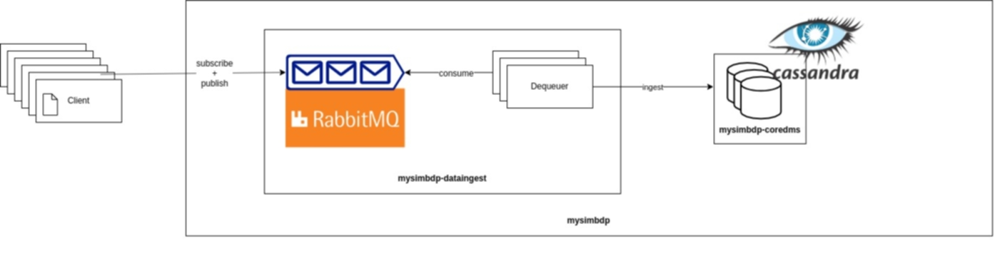

# BDP - Assignment 1

## Overview

In this assignment we simulate ingestion of the dataset [2018 Yellow Taxi Trip Data](https://data.cityofnewyork.us/Transportation/2018-Yellow-Taxi-Trip-Data/t29m-gskq) into a cassandra cluster, (`mysimbdp-coredms`). The application manages to serve several users at a time (we have tested it with up to 500 concurrent users), with no data loss, thanks to the RabbitMQ cluster employed.

Here is the platform design:

-----

## Project Structure

The deploy uses docker-compose for starting up 2 `cassandra-db` and 2 `bitnami/rabbitmq` containerised nodes. Other two components use containers as well:

* the program setting up the database keyspace (`code/db/setuppers/setup_db.py`, dockerfile in `code/db/setuppers/Dockefile`);
* the program in charge of dequeuing the messages forwarded to the RabbitMQ cluster (`code/queue/consumer.py`, dockerfile in `code/queue/Dockefile`).

 Both are pre-built on top of a docker image of python3 with cassandra-python as a dependency (in `code/utils/Dockerfile`), which I pushed to my docker repository so that it is automatically downloaded when composing.
 
The main building program is started by `./code/run.sh`, which triggers the composition of the docker-compose files (`code/db/docker-compose.yml` and `code/queue/docker-compose.yml`) and then a number of clients (`code/client.py`) specified by the user. 

Logs can be found in `logs` with each file following the format:

	`<log_type>_<client_number>.log` 

where `log_type` is one of `db`, `queue`, `client` and `client_number` is the number of concurrent clients run for the ingestion. 

-----
